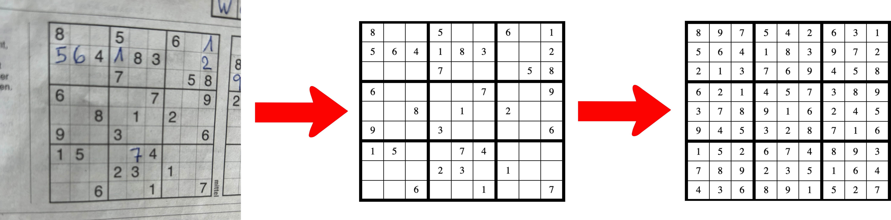

# Sudoku Solver and Recognizer

## Description
This project is designed to recognize and solve Sudoku puzzles from images. It employs image processing and constraint programming (integer optimization) to enable users to upload an image of a Sudoku puzzle and receive the solved puzzle as output. The recognizer is capable of identifying both handwritten and printed digits, and the solver can find all possible solutions if multiple exist.

## Features
- **Sudoku Recognition**: Recognizes Sudoku puzzles from images containing both handwritten and printed digits.
- **Sudoku Solving**: Solves the recognized Sudoku puzzles using constraint programming.
- **Web Interface**: Offers an intuitive interface for user interaction with the application.

## Installation & Setup
```sh
# Clone the repository to your local machine.
git clone https://github.com/silvansuter/Sudoku-Detector-and-Solver

# Install the required packages.
pip install -r requirements.txt

# Run the application.
python main.py
```
Then navigate to `http://127.0.0.1:5000/` in your web browser to use the application.

## Usage
1. **Upload Page**: Users are greeted with an upload page, allowing them to upload an image of a Sudoku puzzle.
2. **Recognition & Solution**: After uploading, the recognized puzzle is displayed, and users can request solutions for the recognized Sudoku. The recognition currently works best for photos of Sudokus (with some number maybe filled in already), in contrast to images of computer generated puzzles.

Pressing the 'reset' button, allows to upload a new image.

## Visualization


In the visualization above:
1. **Left**: The original, raw image of the Sudoku puzzle as inputted by the user.
2. **Middle**: The extracted Sudoku.
3. **Right**: The final, solved Sudoku puzzle, obtained through the application of our solving algorithm.

## File Structure
- `main.py`: Main file containing the Flask application and routes.
- `demo.ipynb`: Jupyter Notebook serving as a demonstration of the recognizing and solving functions.
- `puzzle_recognizer.py`: File containing functions and logic related to recognizing Sudoku puzzles from images.
- `sudoku_solver.py`: File containing Sudoku solving logic, using constraint programming and Google OR-Tools, and related functions.
- `representing_sudoku.py`: File containing functions for visualizing Sudokus in Python
- `digit_recognizer.py`: File for training CNN on images of hand-written and printed digits.
- `loader.py`: File for loading images of printed digits.

## Technologies Used
- **OpenCV**: For image processing tasks.
- **Keras**: For training a CNN for recognizing handwritten and printed digits.
- **Google OR-Tools**: For solving Sudoku using constraint programming.
- **Flask**: For creating the web application.
- **JavaScript & jQuery**: For dynamic client-side scripting.

## Sudoku Recognition Approach
In a first step, the Sudoku image is located in the image. The image is then warped so that the Sudoku lies flat. The cells of the Sudoku can now be located evenly distributed in the 9x9 grid. After cleaning these cells from noise, a convolutional nerual network is used to predict the number in each cell (or 0, if the cell is empty).

The digit recognition is handled by a Convolutional Neural Network (CNN) created using TensorFlow's Keras. The model structure is as follows:
```python
model = keras.Sequential([
    keras.layers.Conv2D(32, kernel_size=(3, 3), activation='relu', input_shape=(28, 28, 1)),
    keras.layers.MaxPooling2D(pool_size=(2, 2)),
    keras.layers.Conv2D(64, kernel_size=(3, 3), activation='relu'),
    keras.layers.MaxPooling2D(pool_size=(2, 2)),
    keras.layers.Flatten(),
    keras.layers.Dense(128, activation='relu'),
    keras.layers.Dropout(0.5),
    keras.layers.Dense(10, activation='softmax')
])
```

## Sudoku Solving Approach
The Sudoku solving is accomplished using constraint programming with Google OR-Tools. The code is structured to form constraints such that each row, column, and 3x3 box has unique numbers from 1 to 9. It also accommodates any predefined numbers in the input Sudoku and finds solutions that adhere to all the constraints. Additionally, the solver is capable of finding multiple solutions, if they exist, by avoiding previously found solutions in subsequent solving attempts. The solver’s function and constraints are defined in `sudoku_solver.py`.

Here’s a snippet demonstrating the solving approach:
```python
from ortools.sat.python import cp_model

def sudokuSolver(inputSudoku, othersolution_support=[]):
    model = cp_model.CpModel()
    # Define variables, add constraints and solve the model.
    # ...
```

## Demonstration
`demo.ipynb` serves as a demonstration notebook, illustrating the capabilities of the Sudoku recognizing and solving functionalities.

## References
- Printed digits dataset: [GitHub - kaydee0502/printed-digits-dataset](https://github.com/kaydee0502/printed-digits-dataset)
- Localization and warping approach: [OpenCV Sudoku Solver and OCR](https://pyimagesearch.com/2020/08/10/opencv-sudoku-solver-and-ocr/). The preparation and recognition of digits is loosely based also on this post.
- Sudoku plotting function: [StackExchange - Draw a Sudoku Board](https://codegolf.stackexchange.com/questions/126930/draw-a-sudoku-board-using-line-drawing-characters)
- Sources of the Sudoku Images: [sudoku1](https://raetsel.ch/raetseluebersicht/sudoku/), [sudoku2](), [sudoku3](https://en.wikipedia.org/wiki/Sudoku_solving_algorithms#/media/File:Sudoku_Puzzle_by_L2G-20050714_standardized_layout.svg), [sudoku4](https://f-puzzles.com)

## Planned Features
- **Recognition Improvement**: Enhancements are planned to rectify any inaccuracies in the recognition process.
- **Value Correction**: In the application, users should be able to correct wrongly recognized numbers with a double click.

## Licensing
This project is licensed under the MIT License. This allows others to use, modify, and distribute this software without restriction.

For full details, please see the LICENSE file in the repository.
